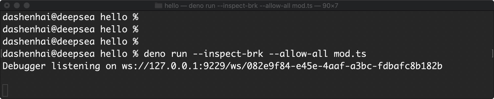
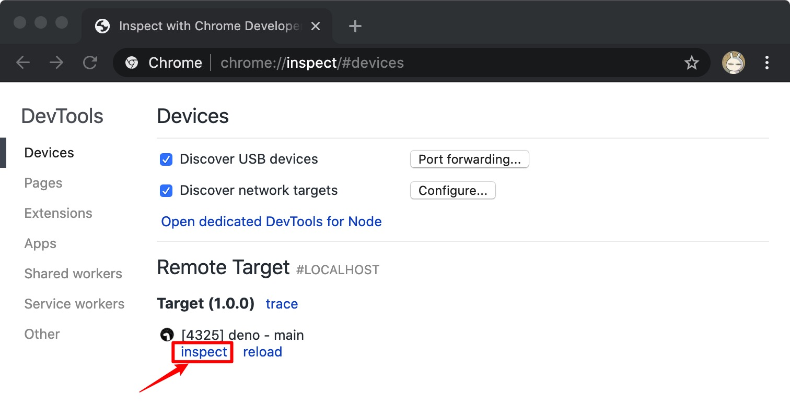
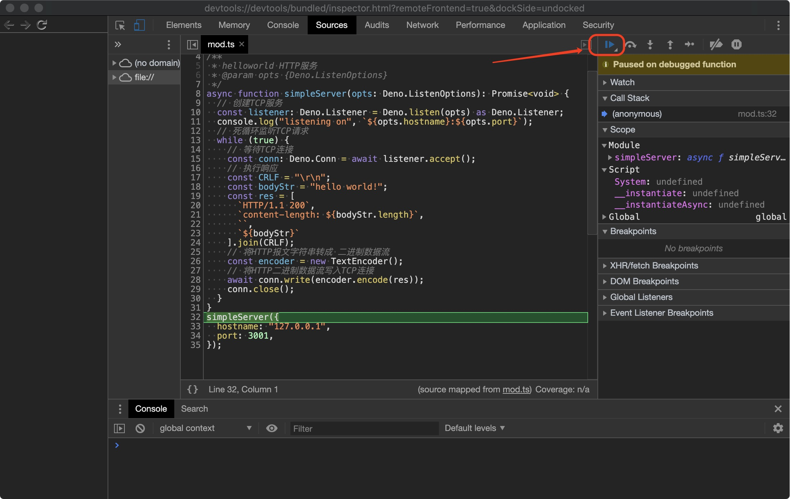
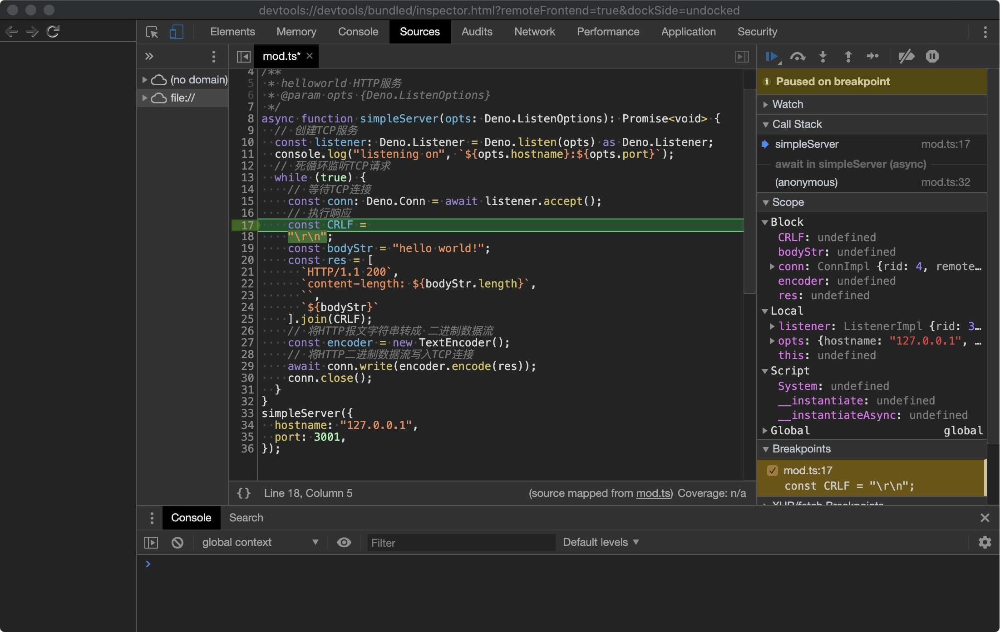

# Deno的开发Debug

## 前言

Debug 断点代码是开发过程中比较重要的操作，`Deno` 是借助 `Chrome` 的 `inpsect` 能力来实现Debug断点的功能。这一点和 `Node.js` 很类似。

## Debug 操作


### 准备代码

这里准备了 [./demo/hello/mod.ts](https://github.com/chenshenhai/deno_note/blob/master/demo/hello/mod.ts) 下的测试代码

```js
// deno --allow-net  mod.ts

/**
 * helloworld HTTP服务
 * @param opts {Deno.ListenOptions}
 */
async function simpleServer(opts: Deno.ListenOptions): Promise<void> {
  // 创建TCP服务
  const listener: Deno.Listener = Deno.listen(opts) as Deno.Listener;
  console.log("listening on", `${opts.hostname}:${opts.port}`);
  // 死循环监听TCP请求
  while (true) {
    // 等待TCP连接
    const conn: Deno.Conn = await listener.accept();
    // 执行响应
    const CRLF = "\r\n";
    const bodyStr = "hello world!";
    const res = [
      `HTTP/1.1 200`,
      `content-length: ${bodyStr.length}`,
      ``,
      `${bodyStr}`
    ].join(CRLF);
    // 将HTTP报文字符串转成 二进制数据流
    const encoder = new TextEncoder();
    // 将HTTP二进制数据流写入TCP连接
    await conn.write(encoder.encode(res));
    conn.close();
  }
}
simpleServer({
  hostname: "127.0.0.1",
  port: 3001,
});
```

### 启动 Debug Flag 调试

```sh
deno run --inspect-brk --allow-all mod.ts 
```

会出现以下的情况



### 打开Chrome浏览器的 inspect

[chrome://inspect](chrome://inspect)



### 释放默认的断点，就可以开始调试了



### 打断点调试

- 打断点
- 访问 [http://127.0.0.1:3001](http://127.0.0.1:3001) 
- 就可以断点调试了


