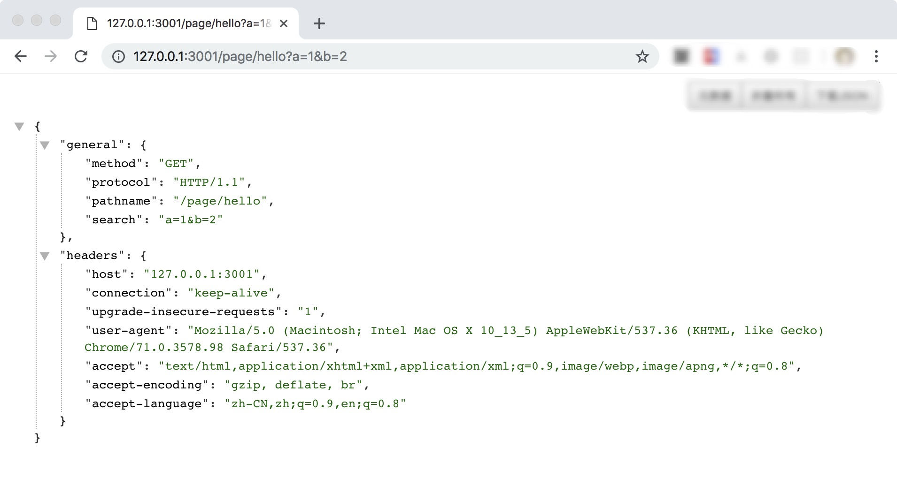
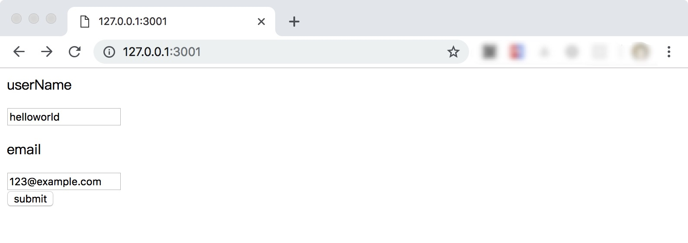
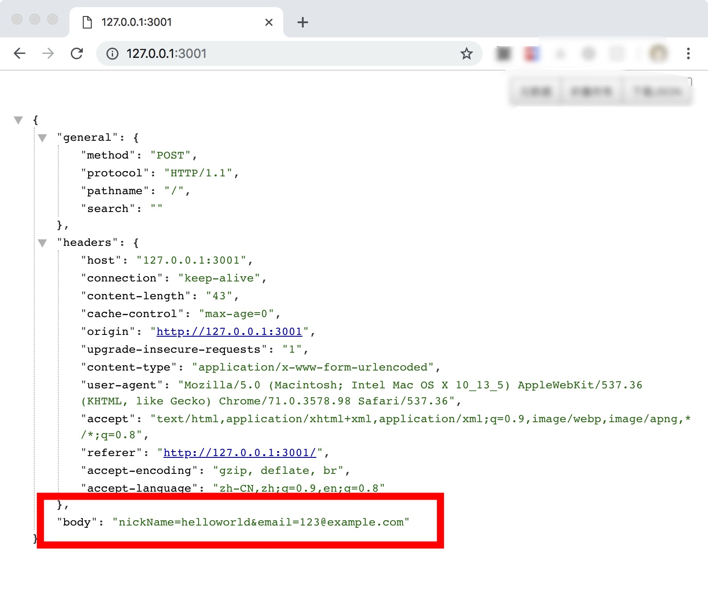

# 原生Deno处理HTTP请求

## 前言

从前面的文章[《原生Deno实现简单HTTP服务》](https://github.com/chenshenhai/deno_note/blob/master/note/chapter_05/07.md)，可以了解到，`Deno` 实现一个`HTTP` 服务，是基于原生提供的监听模块 `listen` 去监听`TCP`服务的。当浏览器发起服务地址请求，建立`TCP`对话连接，也就是把浏览器请求报文`Request`的信息通过`TCP`对话发送到服务端。

`HTTP`服务的请求报文，要从`TCP`对话连接读取。`Deno`实现的`TCP`对话连接数据类型是 `Conn`, 而`Conn`是基于`Deno`的`Reader`、`Writer`和`Closer` 数据类型派生出来的。因此，`TCP`的对话连接是一种`Buffer`类型的数据，想要读取HTTP请求报文，就需要借助前面一篇[5.5 Buffer进阶读操作](https://github.com/chenshenhai/deno_note/blob/master/note/chapter_05/05.md)的内容，来对`HTTP`请求报文做数据读取。

## 实现原理

- 读取请求行，读取第一行
  - 协议信息
  - 请求类型
  - 请求路径
- 读取请求头headers
  - 从第二行开始读起，直至空行
- 空行，分割请求头和请求体
- 读取请求体body
  - 从空行下一行开始读起
  - 据headers的content-length从上一步空行后开始读起至对应长度

## 具体实现

### 实现代码

#### 具体代码地址

[https://github.com/chenshenhai/deno_note/blob/master/demo/request/mod.ts](https://github.com/chenshenhai/deno_note/blob/master/demo/request/mod.ts)

#### 具体代码讲解

`./demo/request/mod.ts`

```js

// 参考源码: https://github.com/lenkan/deno-http/blob/master/src/buffered-reader.ts
// 参考源码: https://github.com/denoland/deno_std/blob/master/textproto/mod.ts

// 这里借用前面 buffer读数据的操作类
import { BufferReader } from "./../buffer_reader/mod.ts";


/**
 * 请求通用信息接口
 */
export interface ReqGeneral {
  method: string;
  pathname: string;
  protocol: string;
  search: string;
}

/**
 * 请求报文接口
 */
export interface Request {
  getHeaders(): Promise<Headers>;
  getGeneral(): Promise<ReqGeneral>;
  getBodyStream(): Promise<Uint8Array>;
  isFinish(): boolean;
}

export class RequestReader implements Request {
  private _bufferReader: BufferReader; // 内置buffer阅读器
  private _size = 1024; // 内置读数据缓冲区默认大小为 1024
  
  private _headers: Headers | null; // HTTP头部信息
  private _method: string | null; // HTTP请求行，方法信息
  private _protocol: string | null; // HTTP请求行，协议信息
  private _pathname: string | null; // HTTP请求行，请求路径
  private _search: string | null;  // HTTP请求参数

  private _bodyStream: Uint8Array | null;

  constructor(conn: Deno.Conn, size?: number) {
    if (typeof size !== 'undefined') {
      if (size > 0) {
        this._size = size;
      }
    }
    this._bufferReader = new BufferReader(conn, this._size);
    this._method = null;
    this._protocol = null;
    this._pathname = null;
    this._search = null;

    this._headers = null;
    this._bodyStream = null;
  }

  /**
   * 读取通用信息，也就是HTTP请求行信息
   * @returns {Promise<ReqGeneral>}
   * */
  async getGeneral(): Promise<ReqGeneral> {
    await this._initHeaderFristLineInfo();
    return {
      method: this._method || '',
      protocol: this._protocol || '',
      pathname: this._pathname || '',
      search: this._search || '',
    };
  }

  /**
   * 读取头部信息
   * @returns {Promise<Headers>}
   * */
  async getHeaders(): Promise<Headers> {
    if (this._headers) {
      return this._headers;
    }
    const headers = new Headers();
    let isHeadersFinished = false;
    await this._initHeaderFristLineInfo();
    while(!isHeadersFinished) {
      const line: string = await this._readLine();
      // 如果为空字符串，那就是headers和body的分界
      if (!line) {
        isHeadersFinished = true;
        break;
      }
      let index = line.indexOf(":");
      if (index < 0) {
        continue;
      }
      let endKey = index;
      while (endKey > 0 && line[endKey - 1] === " ") {
        endKey--;
      }

      //let key = canonicalMIMEHeaderKey(kv.subarray(0, endKey));
      const key = line.substring(0, endKey);

      // As per RFC 7230 field-name is a token, tokens consist of one or more chars.
      // We could return a ProtocolError here, but better to be liberal in what we
      // accept, so if we get an empty key, skip it.
      if (key === "") {
        continue;
      }

      // Skip initial spaces in value.
      index++; // skip colon
      while (
        index < line.length &&
        (line[index] === " " || line[index] === "\t")
      ) {
        index ++;
      }
      const value = line.substring(index);
      headers.append(key, value);
    }
    this._headers = headers;
    return headers;
  }

  isFinish(): boolean {
    return this._bodyStream !== null;
  }

  /**
   * 读取请求体信息
   * @returns {Promise<Uint8Array>}
   * */
  async getBodyStream(): Promise<Uint8Array> {
    if (this._bodyStream) {
      return this._bodyStream;
    }
    const headers = await this.getHeaders();
    const contentLength = parseInt(headers.get("Content-Length") || "0", 10);
    let bodyStream = new TextEncoder().encode("");
    if (contentLength > 0) {
      bodyStream = await this._bufferReader.readCustomChunk(contentLength);
    }
    this._bodyStream = bodyStream;
    return bodyStream;
  }

  /**
   * 初始化 HTTP请求行信息
   * */
  private async _initHeaderFristLineInfo() {
    if (this._method !== null || this._pathname !== null || this._protocol !== null) {
      return;
    }
    // example "GET /index/html?a=1 HTTP/1.1";
    const firstLine = await this._readLine();
    const regMatch = /([A-Z]{1,}){1,}\s(.*)\s(.*)/;
    const strList : string[] = firstLine.match(regMatch) || [];
    const method : string = strList[1] || "";
    const href : string = strList[2] || "";
    const protocol : string = strList[3] || "";
    const pathname : string = href.split("?")[0] || "";
    const search : string = href.split("?")[1] || "";

    this._method = method;
    this._protocol = protocol;
    this._pathname = pathname;
    this._search = search;
  }

  private async _readLine (): Promise<string>  {
    return await this._bufferReader.readLine();
  }
  
}

```

#### 实现代码的单元测试

具体参考 [https://github.com/chenshenhai/deno_note/blob/master/demo/request/test.ts](https://github.com/chenshenhai/deno_note/blob/master/demo/request/test.ts)

`./demo/request/test.ts`

```js
#!/usr/bin/env deno run --allow-run --allow-net

import { assertEquals, equal } from "https://deno.land/std@v0.50.0/testing/asserts.ts";
import { BufferReader } from "./../buffer_reader/mod.ts";

const test = Deno.test;
const run = Deno.run;

const decoder = new TextDecoder();
const testSite = "http://127.0.0.1:3001";
// 启动测试服务

let httpServer: Deno.Process;

async function startHTTPServer() {
  httpServer = run({
    cmd: [
      Deno.execPath(), "run",
      "--allow-net",
      "./demo/request/test_server.ts",
      "--",
      ".",
      "--cors"
    ],
    stdout: "piped"
  });
  const buffer: (Deno.Reader & Deno.Closer) | undefined = httpServer.stdout;
  if (buffer) {
    const bufReader: BufferReader = new BufferReader(buffer);

    const line = await bufReader.readLine();
    equal("listening on 127.0.0.1:3001", line)
    console.log('\r\nstart http server\r\n')
  } else {
    throw Error('Testing server started failfully!')
  }
}

function closeHTTPServer() {
  if (httpServer) {
    httpServer.close();
    httpServer.stdout && httpServer.stdout.close();
  }
  console.log('\r\nclose http server\r\n')
}

test('serverGetRequest', async function() {
  try {
    // 等待服务启动
    await startHTTPServer();
    const res = await fetch(`${testSite}/page/test.html?a=1&b=2`, {
      method: "GET", // *GET, POST, PUT, DELETE, etc.
      mode: "cors",
      cache: "no-cache",
      credentials: "same-origin",
      headers: {
        "Content-Type": "application/json",
        "Content-test": "helloworld"
      },
      redirect: "follow", // manual, *follow, error
      referrer: "no-referrer", // no-referrer, *client
    });
    const json = await res.json();
    const acceptResult = {
      "general": {
        "method": "GET",
        "protocol": "HTTP/1.1",
        "pathname": "/page/test.html",
        "search": "a=1&b=2"
      },
      "headers": {
        "content-type": "application/json",
        "content-test": "helloworld",
        "accept-encoding": "gzip, br",
        "user-agent": `Deno/${Deno.version.deno}`,
        "accept": "*/*",
        "host": "127.0.0.1:3001"
      },
      "body": "",
      "beforeFinish": false,
      "afterFinish": true
    }
    
    assertEquals(json, acceptResult);
  } finally {
    closeHTTPServer();
  }
});


test('serverPostRequest', async function() {
  try {
    // 等待服务启动
    await startHTTPServer();
    const res = await fetch(`${testSite}/page/test.html?a=1&b=2`, {
      method: "POST", // *GET, POST, PUT, DELETE, etc.
      mode: "cors", // no-cors, cors, *same-origin
      cache: "no-cache", // *default, no-cache, reload, force-cache, only-if-cached
      credentials: "same-origin", // include, *same-origin, omit
      headers: {
        "Content-Type": "application/x-www-form-urlencoded",
      },
      redirect: "follow", // manual, *follow, error
      referrer: "no-referrer", // no-referrer, *client
      body: "formData1=1&formData1=2", // body data type must match "Content-Type" header
    });
    const json = await res.json();
    const acceptResult = {
      "general":{
        "method":"POST",
        "protocol":"HTTP/1.1",
        "pathname":"/page/test.html",
        "search":"a=1&b=2"
      },
      "headers":{
        "content-type":"application/x-www-form-urlencoded",
        "user-agent": `Deno/${Deno.version.deno}`,
        "accept":"*/*",
        "host":"127.0.0.1:3001",
        "content-length":"23",
        "accept-encoding": "gzip, br",
      },
      "body":"formData1=1&formData1=2",
      "beforeFinish":false,
      "afterFinish":true
    }
    
    assertEquals(json, acceptResult);
  } finally {
    closeHTTPServer();
  }
});
```

### 处理GET请求使用例子

#### 具体代码地址
[https://github.com/chenshenhai/deno_note/blob/master/demo/request/example_get.ts](https://github.com/chenshenhai/deno_note/blob/master/demo/request/example_get.ts)

#### 具体代码讲解

`./demo/request/example_get.ts`

```js
import { Request, RequestReader } from "./mod.ts";

function createResponse (bodyStr: string): Uint8Array {
  const CRLF = "\r\n";
  const encoder = new TextEncoder();
  const ctxBody = encoder.encode(bodyStr);
  const resHeaders = [
    `HTTP/1.1 200`,
    `content-length: ${ctxBody.byteLength}`,
    CRLF
  ];
  const ctxHeader = encoder.encode(resHeaders.join(CRLF));
  const data = new Uint8Array(ctxHeader.byteLength + ctxBody.byteLength);
  data.set(ctxHeader, 0);
  data.set(ctxBody, ctxHeader.byteLength);
  return data;
}

async function response(conn: Deno.Conn) {
  const requestReader: Request = new RequestReader(conn);
  const headers: Headers = await requestReader.getHeaders();
  const headerObj:{[key: string]: string|null} = {};
  for(const key of headers.keys()) {
    headerObj[key] = headers.get(key); 
  }
  const generalObj = await requestReader.getGeneral();
  const ctx = createResponse(JSON.stringify({ general: generalObj, headers: headerObj }));
  await conn.write(ctx);
  conn.close();
}

async function server(opts: Deno.ListenOptions) {
  const listener: Deno.Listener = Deno.listen(opts) as Deno.Listener;
  console.log(`listening on ${opts.hostname}:${opts.port}`);
  while (true) {
    const conn = await listener.accept();
    await response(conn);
  }
}

const opts: Deno.ListenOptions = {
  hostname: "127.0.0.1",
  port: 3001
}
server(opts);
```

#### 代码执行

```sh
deno run --allow-net example_get.ts
```

#### 浏览器访问

浏览器访问 [http://127.0.0.1:3001/page/hello?a=1&b=2](http://127.0.0.1:3001/page/hello?a=1&b=2) 可看到一下结果




### 处理POST请求例子

#### 具体代码地址
[https://github.com/chenshenhai/deno_note/blob/master/demo/request/example_post.ts](https://github.com/chenshenhai/deno_note/blob/master/demo/request/example_post.ts)

#### 具体代码讲解

`./demo/request/example_post.ts`

```js
import { Request, ReqGeneral, RequestReader } from "./mod.ts";

const decoder = new TextDecoder();

function createResponse (bodyStr: string): Uint8Array {
  const CRLF = "\r\n";
  const encoder = new TextEncoder();
  const ctxBody = encoder.encode(bodyStr);
  const resHeaders = [
    `HTTP/1.1 200`,
    `content-length: ${ctxBody.byteLength}`,
    CRLF
  ];
  const ctxHeader = encoder.encode(resHeaders.join(CRLF));
  const data = new Uint8Array(ctxHeader.byteLength + ctxBody.byteLength);
  data.set(ctxHeader, 0);
  data.set(ctxBody, ctxHeader.byteLength);
  return data;
}

async function response(conn: Deno.Conn) {
  const requestReader: Request = new RequestReader(conn);
  const headers: Headers = await requestReader.getHeaders();
  const headerObj: {[key: string]: string|null} = {};
  if (headers) {
    for(const key of headers.keys()) {
      headerObj[key] = headers.get(key); 
    }
  }
  
  const generalObj: ReqGeneral = await requestReader.getGeneral();
  const bodyBuf = await requestReader.getBodyStream();
  const method = generalObj.method;
  let ctxBody = `
    <html>
      <body>
        <form method="POST" action="/">
          <p>userName</p>
          <input name="nickName" /><br/>
          <p>email</p>
          <input name="email" /><br/>
          <button type="submit">submit</button>
        </form>
      </body>
    </html>
  `;
  if (method === "POST") {
    const body = decoder.decode(bodyBuf);
    ctxBody = JSON.stringify({ general: generalObj, headers: headerObj, body });
  }
  const ctx = createResponse(ctxBody);
  await conn.write(ctx);
  conn.close();
}

async function server(opts: Deno.ListenOptions) {
  const listener: Deno.Listener = Deno.listen(opts) as Deno.Listener;
  console.log(`listening on ${opts.hostname}:${opts.port}`);
  while (true) {
    const conn = await listener.accept();
    await response(conn);
  }
}

const opts: Deno.ListenOptions = {
  hostname: "127.0.0.1",
  port: 3001
}
server(opts);
```

#### 代码执行

```sh
deno run --allow-net example_post.ts
```

#### 浏览器访问

- 浏览器访问 [http://127.0.0.1:3001/](http://127.0.0.1:3001/)
- 输入提交表单可以看到结果如下






