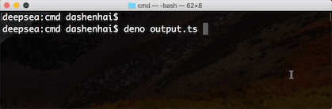
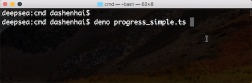
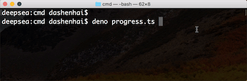
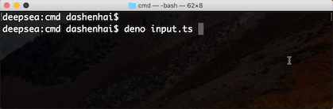

# 终端输入/输出 效果处理

## 前言

日常用 Node.js 的 CLI 工具，会发现有很多 控制台的动效和输入输出交互等操作。控制台的输入输出操作都依赖终端的标准输入/输出。`Deno`官方提供了标准终端输入输出的接口，有以下接口

- 标准输入
  - `Deno.stdin.read()` 异步标准输入
  - `Deno.stdin.readSync()` 同步标准输入
- 标准输出
  - `Deno.stdout.write()` 异步标准输出
  - `Deno.stdout.writeSync()` 同步标准输出

以下将会利用 `Deno` 标准输入输出实现一些常用的效果


## 终端输出进度信息

### 实现效果



### 实现源码

源码地址 [https://github.com/chenshenhai/deno_note/blob/master/demo/cmd/output.ts](https://github.com/chenshenhai/deno_note/blob/master/demo/cmd/output.ts)

```js
import { sleep, printNewLine } from "./util.ts";

class Output {
  private _beforeLength: number = 0;

  public print(text: string): void {
    const encode = new TextEncoder();
    const chunk = encode.encode(`\x1b[${this._beforeLength}D \x1b[K ${text}`);
    Deno.stdout.writeSync(chunk);
    this._beforeLength = chunk.length;
  }
}

async function main() {
  const output = new Output();
  for (let i = 0; i < 100; i ++) {
    await sleep(10);
    output.print(`${i}%`);
  }
  printNewLine();
}

main();

```


## 终端输出简单进度条

### 实现效果



### 实现源码

源码地址 [https://github.com/chenshenhai/deno_note/blob/master/demo/cmd/progress_simple.ts](https://github.com/chenshenhai/deno_note/blob/master/demo/cmd/progress_simple.ts)

```js
import { sleep, printNewLine } from "./util.ts";

const frame: string = "▊";

class Progress {

  public async run(time: number = 1000, percent: number = 100, modulo: number = 2) {
    const count = Math.floor(percent / modulo);
    for (let i = 0; i < count; i ++) {
      await sleep(time / count);
      this._print();
    }
    printNewLine();
  }

  private _print(): void {
    const encode = new TextEncoder();
    const chunk = encode.encode(`\x1b[K${frame}`);
    Deno.stdout.writeSync(chunk);
  }

}

const progress = new Progress();
progress.run(1000, 100);
```


## 终端输出复杂进度条

### 实现效果



### 实现源码

源码地址 [https://github.com/chenshenhai/deno_note/blob/master/demo/cmd/progress.ts](https://github.com/chenshenhai/deno_note/blob/master/demo/cmd/progress.ts)

```js
import { sleep, printNewLine, clearLine } from "./util.ts";

const frame: string = "▓";
const backgroundFrame: string = "░";

class Progress {

  public async run(time: number = 1000, percent: number = 100, modulo: number = 2) {
    const count = Math.floor(percent / modulo);

    for (let i = 0; i < count; i ++) {
      await sleep(time / count);
      const progressLength = this._printProcess(i, count, modulo);
      if (i < count - 1) {
        clearLine(progressLength);
      }
    }
    printNewLine();
  }

  private _printProcess(index: number, count: number, modulo: number) {
    let progressLength: number = 0;
    for (let i = 0; i < count; i ++) {
      if (i <= index) {
        progressLength += this._print(frame);
      } else {
        progressLength += this._print(backgroundFrame);
      }
    }

    let percentNum: number = (index + 1) * modulo;
    percentNum = Math.min(100, percentNum);
    percentNum = Math.max(0, percentNum);
    progressLength += this._print(` ${percentNum}%`);
    return progressLength;
  }

  private _print(text: string, leftMoveCols?: number): number {
    const encode = new TextEncoder();
    let code: string = `\x1b[K${text}`;
    if (leftMoveCols! >= 0) {
      code = `\x1b[${leftMoveCols}D\x1b[K${text}`;
    }

    const chunk = encode.encode(`\x1b[K${text}`);
    Deno.stdout.writeSync(chunk);
    return chunk.length;
  }

}

const progress = new Progress();
progress.run(1000, 100);
```

## 监听并获取终端输入信息

### 实现效果



### 实现源码

```js
const decoder = new TextDecoder();

class Input {
  private _tip: string;
  constructor(tip: string = 'Please input something: ') {
    this._tip = tip;
  }

  public async listenInput(): Promise<string> {
    let result: string = '';
    return new Promise(async (resolve) => {
      while(1) {
        this._print(this._tip);
        const text: string = await this._getInput();
        if (text.length > 0) {
          result = text;
          break;
        }
      }
      resolve(result);
    })
  }

  private _print(text: string): void {
    const encode = new TextEncoder();
    const chunk = encode.encode(`\x1b[0D \x1b[K ${text}`);
    Deno.stdout.writeSync(chunk);
  }

  private async _getInput(maxLen: number = 64): Promise<string> {
    const chunk = new Uint8Array(maxLen);
    const len: number = await Deno.stdin.read(chunk) as number;
    const text = decoder.decode(chunk.slice(0, len));
    return text;
  }
}


(async () => {
  const input = new Input('Please input your name: ');
  const text = await input.listenInput();
  console.log(`------------------------------`);
  console.log(`name = ${text}`);
})();
```

## 后记
 
本文里关于 终端输出动效的原理，可以查看我的一篇博客[《终端控制台的画笔: ANSI转义序列》](https://github.com/chenshenhai/blog/issues/39)

