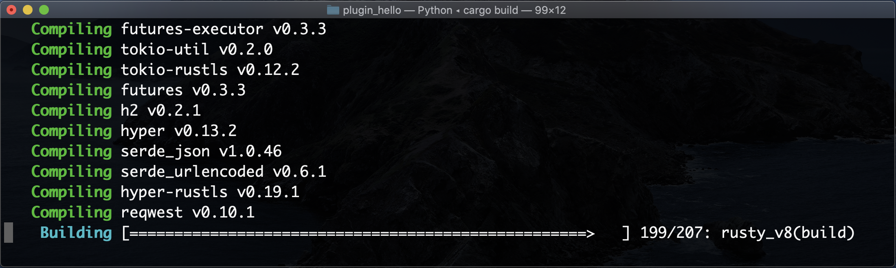

# 插件开发入门

## 前言

## 环境

- MacOS `v10.15+`
  - Xcode `v11.3.1+`
- Rust `v1.41.0 +`

## 开发插件

### 初始化Rust项目

```sh
# 创建目录
mkdir plugin_hello

# 进入目录
cd plugin_hello

# 执行 Rust项目初始化
cargo init
```

### 初始化插件设置

#### 配置Rust依赖

在项目目录的Rust `./Cargo.toml` 添加开发 Deno 插件的 配置Rust依赖

```toml
[dependencies]
futures = "0.3.1"
deno_core = "0.31"
deno = "0.31"
```

设置编译类型

```toml
[lib]
crate-type = ["cdylib"]
```

最后完整`Cargo.toml`结果为 

```toml
[package]
name = "plugin_hello"
version = "0.1.0"
authors = [""]
edition = "2018"

# See more keys and their definitions at https://doc.rust-lang.org/cargo/reference/manifest.html
[lib]
crate-type = ["cdylib"]

[dependencies]
futures = "0.3.1"
deno_core = "0.31"
deno = "0.31"
```

### 编写Rust插件内容

#### 插件源码

- 在项目的 `./src/` 目录下，新建 `lib.rs` 文件。
- 在文件里定义`Deno`插件的异步和同步的两个方法

```rs
#[macro_use]
extern crate deno_core;
extern crate futures;

use deno_core::CoreOp;
use deno_core::Op;
use deno_core::PluginInitContext;
use deno_core::{Buf, PinnedBuf};
use futures::future::FutureExt;

// 初始化
fn init(context: &mut dyn PluginInitContext) {
  context.register_op("testSync", Box::new(op_test_sync));
  context.register_op("testAsync", Box::new(op_test_async));
}
init_fn!(init);

// 定义插件的同步方法
pub fn op_test_sync(data: &[u8], zero_copy: Option<PinnedBuf>) -> CoreOp {
  if let Some(buf) = zero_copy {
    let data_str = std::str::from_utf8(&data[..]).unwrap();
    let buf_str = std::str::from_utf8(&buf[..]).unwrap();
    println!(
      "Hello from plugin. data: {} | zero_copy: {}",
      data_str, buf_str
    );
  }
  let result = b"test";
  let result_box: Buf = Box::new(*result);
  Op::Sync(result_box)
}

// 定义插件的异步方法
pub fn op_test_async(data: &[u8], zero_copy: Option<PinnedBuf>) -> CoreOp {
  let data_str = std::str::from_utf8(&data[..]).unwrap().to_string();
  let fut = async move {
    if let Some(buf) = zero_copy {
      let buf_str = std::str::from_utf8(&buf[..]).unwrap();
      println!(
        "Hello from plugin. data: {} | zero_copy: {}",
        data_str, buf_str
      );
    }
    let (tx, rx) = futures::channel::oneshot::channel::<Result<(), ()>>();
    std::thread::spawn(move || {
      std::thread::sleep(std::time::Duration::from_secs(1));
      tx.send(Ok(())).unwrap();
    });
    assert!(rx.await.is_ok());
    let result = b"test";
    let result_box: Buf = Box::new(*result);
    Ok(result_box)
  };

  Op::Async(fut.boxed())
}
```

#### 编译插件

在项目目录下执行 Cargo对Rust的编译

```sh
cargo build
```

初次编译会等待很久，因为要下载 `deno`和`deno_core` 这两个 Rust 依赖。

同时背后又依赖了 `rust_v8` 还要下载 `chromium` 包，所以要等待很久。
短则十几分钟，长则一个小时，o(╯□╰)o！



最后编译成功会显示这样子 (忽略警告)


插件编译成后，在目录 `./target/debug/` 下会生成一系列在不同系统下的可执行文件。

当前是在`MacOS`系统下生成的，所以这里要使用 `./target/debug/libplugin_hello.dylib` 这个生成结果

- `libplugin_hello.dylib` 这个结果命名是`lib` + `{{项目名称}}` + `{{生成库的后缀}}`

### 编写Deno调用的测试用例

在项目目录 `./tests/` 下建一个 `test.ts` 文件


### 编写Rust测试用例


## 测试结果